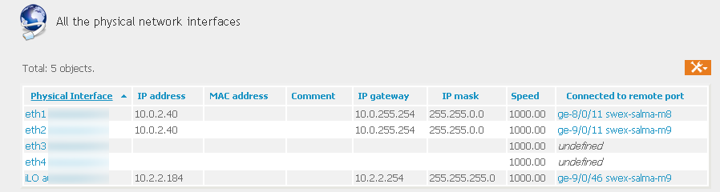

# iTop-NetworkInterfaces-Connect
Interconnects predefined interfaces on CI and on network devices instead of just naming them

# Goal
By default, in iTop, network interfaces are only connected by names. So you create interfaces for a server, for a switch, and when you attempt to create a link between them, you cannot reuse the defined interfaces, you just get a text field with no relation to the actual defined interfaces.

This contribution let you create the link between the predefined interfaces.

In the 'Network Interface' Tab of a Server, you'll see a new field with the remote port

And when selecting a port and modifying it, You'll find in 'Connected to remote port' a choice of all network ports from the same organization and the same location that are unconnected.

Of course, that's the exact opposite if you start from a network device (this one is very little connected here...)

# Warning
While still useable, I remember that in one case, you are able to modify a field that doesn't exist at this time. I tried to put that field in read only without success. 

# Installation
As for all my extensions, just download the zip file, and copy the 'schirrms-...' directory in your extensions directory, then rerun the setup as usual.